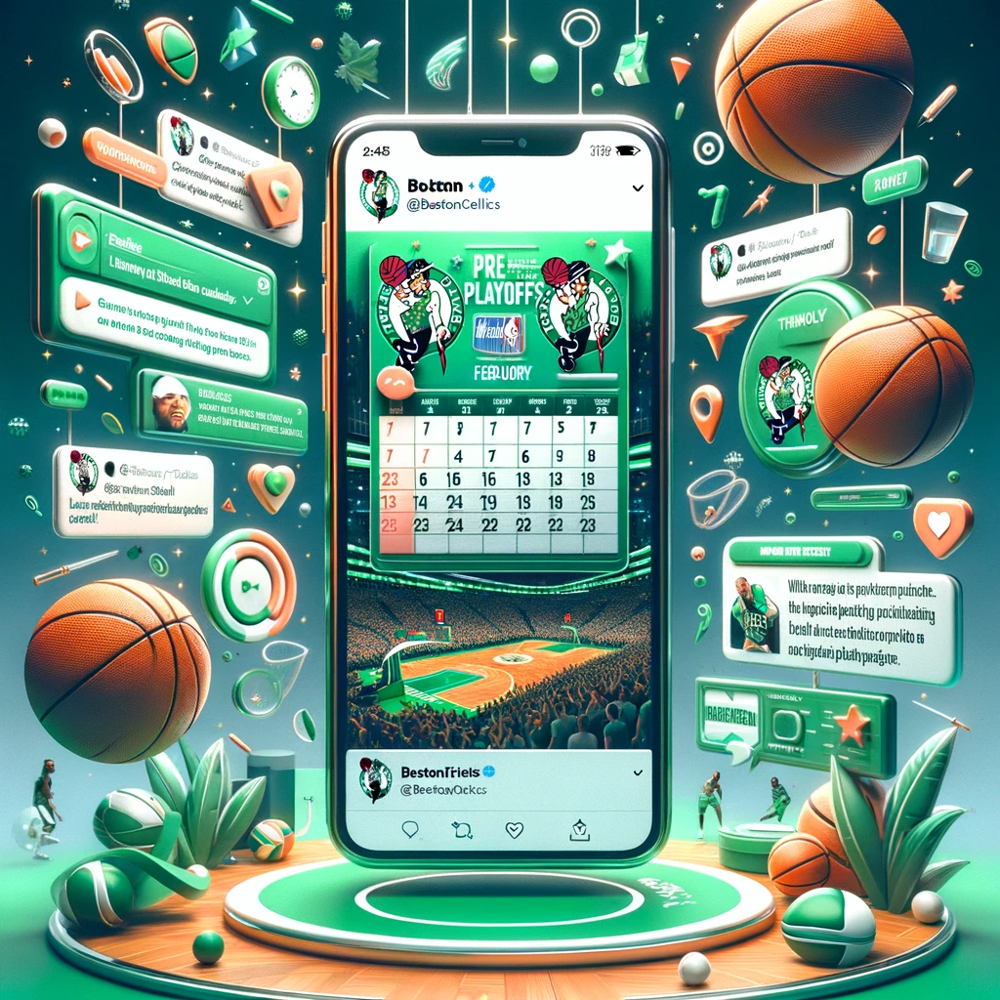
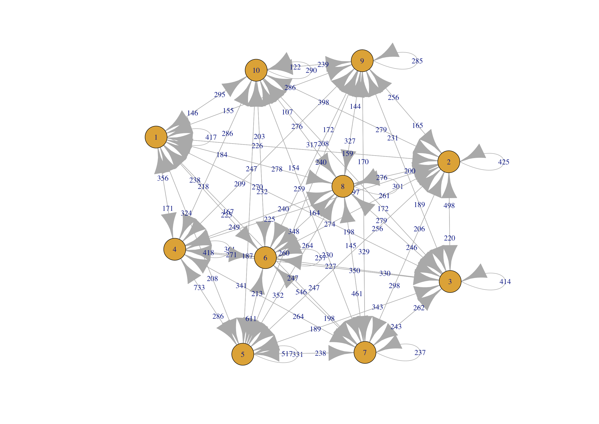
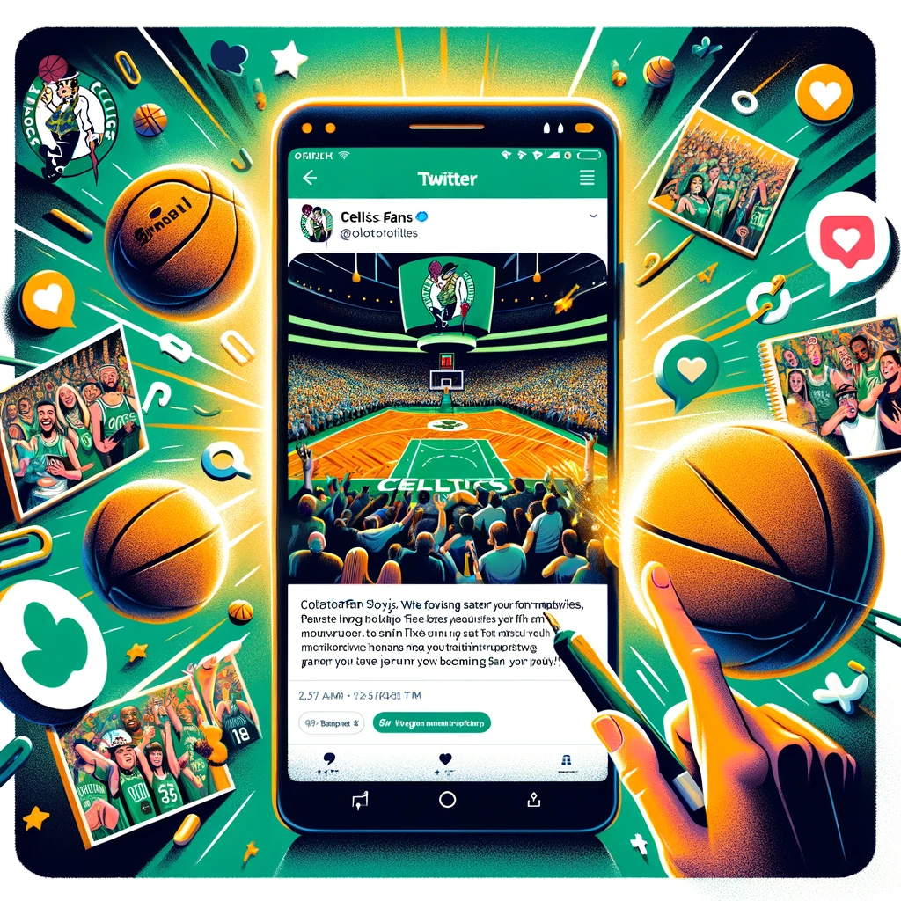
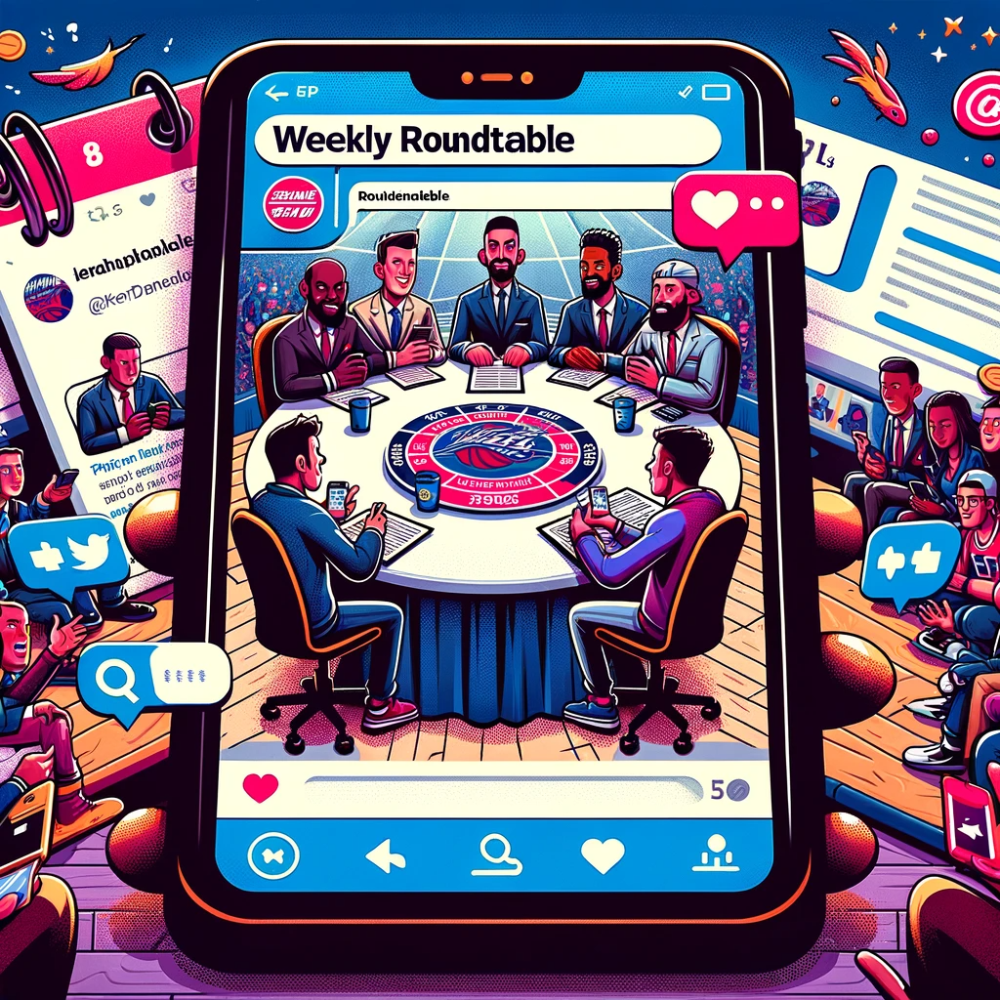
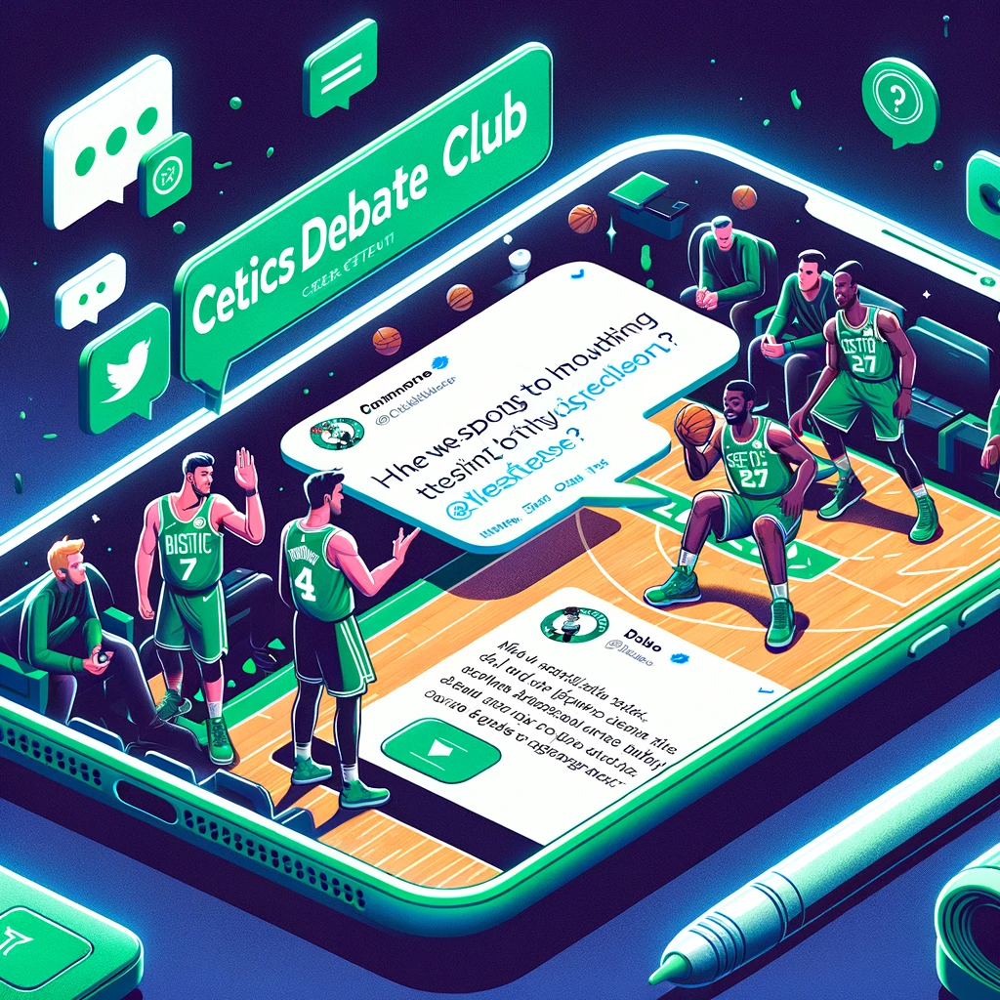

```{r, echo=FALSE, message=FALSE}
library(NLP)
library(stringr)
library(purrr)
library(igraph)
library(crayon)
library(gridExtra)
library(tidyr)
library(ggplot2)
library(gridExtra)
library(ggplot2)
library(reshape2)
library(tm)
library(base)
library(SparseM)
library(SnowballC)
library(tidytext)
library(rio)
library(syuzhet)
library(ggplot2)
library(stargazer)
library(car)
library(plotly)
library(dplyr)
library(sandwich)
library(lmtest)
library(lubridate)
library(topicmodels)
data<-import("Season_2023.xlsx")
data <- data %>% 
  mutate(Day = as.Date(Day, format="%Y-%m-%d")) %>%
  arrange(Day)
data$Likes[is.na(data$Likes)] <- 0
data$Replies[is.na(data$Replies)] <- 0
```

# 1. Sentiment, Topic, and Engagement

## 1.1 Daily Reach Transition By Sentiment

```{r, echo=FALSE, message=FALSE}
text<-data$`Hit Sentence`
text <- gsub("[^\x20-\x7e]"," ", text)
text <- gsub("(@|http)[^[:blank:]]*|[[:punct:]]|[[:digit:]]"," ", text)
text <- gsub("(?<=[\\s])\\s*|^\\s+|\\s+$", "", text, perl=TRUE)
sentiment_bing <- get_sentiment(text, method = "bing")
sentiment_new<-ifelse(sentiment_bing < 0, -1, sentiment_bing)
sentiment_new<-ifelse(sentiment_new > 0, 1, sentiment_new)
sentiment_new<-ifelse(sentiment_new == 0, 0, sentiment_new) 
data$sentiment<-sentiment_new
```
```{r}
data<-data %>%
  group_by(Day) %>%
  mutate(Daily_Reach = mean(Reach, na.rm = TRUE))

gg<-ggplot(data,aes(x=Day,y=Daily_Reach,group=sentiment,color=sentiment)) +
  geom_line() + geom_point() +
  labs(title = "Sentiment Rearch Transition", x = "Day", y = "Daily Reach") +
  theme_minimal()

p <- ggplotly(gg)
p
```

```{r, echo=FALSE, message=FALSE}
positive_sentiment<-subset(data,sentiment==1 )
positive_sentiment <- positive_sentiment %>% 
  filter(grepl("2022", Day) | 
           grepl("2023-01", Day) | 
           grepl("2023-02", Day) |
           grepl("2023-03", Day) |
           grepl("2023-04", Day) |
           grepl("2023-05", Day) |
           grepl("2023-06", Day))
negative_sentiment<-subset(data,sentiment==-1 )
negative_sentiment <- negative_sentiment %>% 
  filter(grepl("2022", Day) | 
           grepl("2023-01", Day) | 
           grepl("2023-02", Day) |
           grepl("2023-03", Day) |
           grepl("2023-04", Day) |
           grepl("2023-05", Day) |
           grepl("2023-06", Day))
neural_sentiment<-subset(data,sentiment==0)
neural_sentiment<-neural_sentiment %>% 
  filter(grepl("2022", Day) | 
           grepl("2023-01", Day) | 
           grepl("2023-02", Day) |
           grepl("2023-03", Day) |
           grepl("2023-04", Day) |
           grepl("2023-05", Day) |
           grepl("2023-06", Day))
```

### Insights

A decreasing trend in the daily reach of tweets with positive sentiment.

## 1.2 Topic Modeling

```{r, echo=FALSE, message=FALSE}
data$document <- 1: length(data$`Hit Sentence`) #assign an unique id each document

myCorpus<-VCorpus(VectorSource(text))

myCorpus<-tm_map(myCorpus, removePunctuation)
myCorpus<-tm_map(myCorpus, removeNumbers)
myCorpus<-tm_map(myCorpus, content_transformer(tolower))
myCorpus<-tm_map(myCorpus, stripWhitespace)
myStopwords <- c(stopwords('english'), "celtics", "boston") 
myCorpus <- tm_map(myCorpus, removeWords, myStopwords)

myDTM <- DocumentTermMatrix(myCorpus, control = list(minWordLength = 3)) 
myDTM <- removeSparseTerms(myDTM,0.995) 

myDTM <- myDTM[rowSums(as.matrix(myDTM))>0,]
```

```{r}
lda.model <- LDA(myDTM, 10, method='Gibbs', control=list(seed=2022))

topic_matrix <- terms(lda.model,10) 
topic_matrix
```

### Topic Categories:

**Category 1: Star Player**

- Topic 2: Centers around Jayson Tatum and related MVP title discussion

- Topic 3: Jaylen Brown and potential trade rumors

**Category 2: Game**

- Topic 1: Timing of games/events

- Topic 6: Strategies/opinions on games

**Category 3: Franchise Management**

- Topic 8: Team Management

- Topic 9: Other players

**Category 4: Fan Engagement**

- Topic 4: Celtics slogan

- Topic 5: Appeal for wining and achievements

- Topic 7: Fans community

- Topic 10: Season statistics & Career achievements

```{r, echo=FALSE, message=FALSE}
gammaDF <- as.data.frame(lda.model@gamma) 
names(gammaDF) <- c(1:10) 


toptopics <- as.data.frame(cbind(document = row.names(gammaDF), topic = apply(gammaDF,1,function(x) names(gammaDF)[which(x==max(x))])))

head(toptopics)

toptopics <- data.frame(lapply(toptopics, as.character), stringsAsFactors=FALSE)  

topicsdocument <- tidy(lda.model , matrix = "gamma")
topicsdocument$content <- data$`Hit Sentence`[match(topicsdocument$document, data$document)]

toptopics$document<-as.numeric(toptopics$document)
data <- left_join(data, toptopics, by = "document")
```

### Insights

Generally, tweets that focus on fan and community engagement tend to have a higher average daily reach compared to other tweets, although these differences are not significant.

## 1.3 Daily Reach/Sentiment by Significant Topic

```{r}
data_1<-data
data_1$topic <- as.numeric(as.character(data_1$topic))
data_1$topic <- recode(data_1$topic, `2` = 1, `3` = 1, `1` = 2, `6` = 2, `8` = 3, `9` = 3, `10` = 4, `4` = 4, `5` = 4, `7` = 4, .default = NA_real_)
tt<-ggplot(data_1,aes(x=Day,y=Daily_Reach,group=as.factor(topic),color=as.factor(topic))) +
  geom_line() + geom_point() +
  labs(title = "Topic Rearch Transition", x = "Day", y = "Daily Reach") +
  theme_minimal()
t <- ggplotly(tt)
t

fan<-subset(data_1,topic==4)
other_topic <- subset(data_1, topic != 4)
t.test(fan$sentiment,other_topic$sentiment,paired=FALSE,alternative="greater")
t.test(fan$Daily_Reach,other_topic$Daily_Reach,paired=FALSE,alternative="greater")

```

## 1.4 Sentiment Transition by Significant Topic

```{r}
fan_engage<-subset(data_1,topic==4)

ss <- ggplot(fan_engage, aes(x = Day, y = Daily_Reach, group = sentiment, color = as.factor(sentiment))) +
  geom_line() + 
  geom_point() +
  labs(title = "Topic & Sentiment Reach Transition", x = "Day", y = "Daily Reach") +
  scale_color_manual(values = c("blue", "red", "green"), labels = c("Negative Sentiment", "Neural Sentiment", "Positive Sentiment"),  name = "Topic") + theme_minimal()

s <- ggplotly(ss)
s <- s %>% layout(legend = list(title = list(text = 'sentiment'),
                                x = 1.05, y = 0.5))
s
```

### Insights

Based on a visual inspection of the results, we cannot determine which sentiments exhibit a distinctly different daily reach throughout an entire season.

## 1.5 Daily Reach Transition

```{r}
reg_1<-lm(Daily_Reach~Day,positive_sentiment)
reg_2<-lm(Daily_Reach~Day,negative_sentiment)
reg_3<-lm(Daily_Reach~sentiment+Day,fan_engage)
stargazer(reg_1,reg_2,reg_3,type="text",star.cutoffs=c(.05,.01,.001))
plot(positive_sentiment$Daily_Reach~positive_sentiment$Day)
abline(reg_1)
```

### Insights

#### 1 Daily Reach \& Sentiment

- **Daily Reach \& Positive Sentiment**: Each additional day is associated with a decrease of 144.021 units in daily reach, indicating a significant negative trend over time for tweets with positive sentiment.

- **Daily Reach \& Negative Sentiment**: Daily reach decreases by 164.246 units with each day, showing a significant negative trend over time for tweets with negative sentiment.

**Some Explanations**

- **late-season Performance Decline \& Adjustment of Expectations**: fans' expectations of the team diminishes, especially when the team fails to meet those expectations.

- **Waning Novelty**: At the beginning of the season, the new start and new possibilities often stimulate interest and positive sentiment. Over time, this novelty may fade.

- **Impact of Significant Events**: if the team is eliminated early in the playoffs, fans' sentiments could be negatively impacted by the disappointment in the postseason.

However, we can also apply this second explanation to our competitor, the LA Lakers, even though their results are still significantly better than those of the Celtics.

```{r, echo=FALSE, message=FALSE}
laker<-import("laker.xlsx")
laker <- laker %>% 
  mutate(Day = as.Date(Day, format="%Y-%m-%d")) %>%
  arrange(Day)
laker$Likes[is.na(laker$Likes)] <- 0
laker$Replies[is.na(laker$Replies)] <- 0


laker_text<-laker$`Hit Sentence`
laker_text <- gsub("[^\x20-\x7e]"," ", laker_text)
laker_text <- gsub("(@|http)[^[:blank:]]*|[[:punct:]]|[[:digit:]]"," ", laker_text)
laker_text <- gsub("(?<=[\\s])\\s*|^\\s+|\\s+$", "", laker_text, perl=TRUE)
sentiment_lakerbing <- get_sentiment(laker_text, method = "bing")
sentiment_asd<-ifelse(sentiment_lakerbing < 0, -1, sentiment_lakerbing)
sentiment_asd<-ifelse(sentiment_asd > 0, 1, sentiment_asd)
sentiment_asd<-ifelse(sentiment_asd == 0, 0, sentiment_asd) 
laker$sentiment<-sentiment_asd
unique(laker$sentiment)


laker<-laker %>%
  group_by(Day) %>%
  mutate(Daily_Reach = mean(Reach, na.rm = TRUE))

ab<-ggplot(laker,aes(x=Day,y=Daily_Reach,group=sentiment,color=sentiment)) +
  geom_line() + geom_point() +
  labs(title = "Sentiment Rearch Transition", x = "Day", y = "Daily Reach") +
  theme_minimal()

la <- ggplotly(ab)
la

positive_sentimentla<-subset(laker,sentiment==1 )
positive_sentimentla <- positive_sentimentla %>% 
  filter(grepl("2022", Day) | 
           grepl("2023-01", Day) | 
           grepl("2023-02", Day) |
           grepl("2023-03", Day) |
           grepl("2023-04", Day) |
           grepl("2023-05", Day) |
           grepl("2023-06", Day))
negative_sentimentla<-subset(laker,sentiment==-1 )
negative_sentimentla <- negative_sentimentla %>% 
  filter(grepl("2022", Day) | 
           grepl("2023-01", Day) | 
           grepl("2023-02", Day) |
           grepl("2023-03", Day) |
           grepl("2023-04", Day) |
           grepl("2023-05", Day) |
           grepl("2023-06", Day))
```
```{r}
reg_1la<-lm(Daily_Reach~Day,positive_sentimentla)
reg_2la<-lm(Daily_Reach~Day,negative_sentimentla)
stargazer(reg_1la,reg_2la,type="text",star.cutoffs=c(.05,.01,.001))
```

- **Transition in Daily Reach for Fan Engagement Discussions**

For these discussions, the decrease in daily reach occurs at a slightly slower rate.

However, the sentiment score acts as a negative predictor of daily reach within these discussions.

# 2. Correlational Analysis

## 2.1 Correlational Matrix For Daily Reach, Sentiment, And other Engagement Actions

```{r, echo=FALSE, message=FALSE}
data$Replies<-as.numeric(data$Replies)
data$Likes<-as.numeric(data$Likes)
data$Reach<-as.numeric(data$Reach)
data$sentiment<-as.numeric(data$sentiment)
data$Day<-as.numeric(data$Day)
measure<-data[,c("Day","Likes","Replies","Daily_Reach","Reach","sentiment")]
cor_matrix<-cor(measure,use="complete.obs")
```

```{r}
melted_cormat <- melt(cor_matrix)
ggplot(data = melted_cormat, aes(x=Var1, y=Var2)) +
  geom_tile(aes(fill=value), color='white') +
  scale_fill_gradient2(low='blue', high='red', mid='grey', midpoint=0, limit=c(-1,1), space='Lab', name='Correlation') +
  theme_minimal() +
  theme(axis.text.x=element_text(angle=45, vjust=1, size=12, hjust=1),
        axis.text.y=element_text(size=12)) +
  coord_fixed()
```

```{r}
data <- data %>% 
  mutate(Day = as.Date(Day, format="%Y-%m-%d")) %>%
  arrange(Day)
```

### Insights

- **Day and Daily Reach**: as the days progress, the daily reach tends to decrease.
- **Likes and Daily Reach**: Tweets with more likes tend to have a clearly higher daily reach.
- **Replies and Daily Reach**: Tweets with more replies are associated with more likes.

### What is actionable

- **Maximize Likes to Boost Reach**: Tweets that receive more likes also get a higher daily reach. The Celtics could focus on creating content that is more likely to be liked by the audience. 

\\\\

- **Encourage Replies for Greater Interaction**: Since replies are associated with higher daily reach, the campaign should encourage followers to reply to tweets.

\\\\


## 2.2 Like & Replies By Months

```{r, echo=FALSE, message=FALSE}
fan_engage$year <- as.numeric(substr(fan_engage$Day, 1, 4))
fan_engage$month_num <- as.numeric(substr(fan_engage$Day, 6, 7))
fan_engage$month_numeric <- (fan_engage$year * 100) + fan_engage$month_num

replypart<-data.frame(Reply = fan_engage$Replies,month=fan_engage$month_numeric)
likepart <- data.frame(Likes = fan_engage$Likes, month = fan_engage$month_numeric)
replypart$month_factor<-factor(replypart$month)
likepart$month_factor <- factor(likepart$month)
```

```{r}
ph_1 <- ggplot(data = replypart, aes(x = month_factor, y = Reply, fill = month_factor)) +
  geom_boxplot() +
  ggtitle("Replies By Months") +
  theme_minimal() +
  scale_fill_discrete(name = "Month") + 
  xlab("Month") + 
  ylab("Replies")

ph_2 <- ggplot(data = likepart, aes(x = month_factor, y = Likes, fill = month_factor)) +
  geom_boxplot() +
  ggtitle("Like By Months") +
  theme_minimal() +
  scale_fill_discrete(name = "Month") + 
  xlab("Month") + 
  ylab("Likes") +
  scale_y_continuous(limits = c(0, 20), oob = scales::squish)

grid.arrange(ph_1, ph_2, ncol = 2)
```

### Insights

- **Replies**: The highest number of replies occurred from 2022.02 to 2022.05.

- **Like**: The greatest number of likes were seen from 2022.05 to 2022.07 and in 2022.09.

## 2.3 Density Plot for Reach Distribution by month

```{r}
fan_engage$month <- substr(fan_engage$Day, 1, 7)

Densityplot <- ggplot(fan_engage, aes(x = Daily_Reach)) +
  geom_density(aes(fill = month), alpha = 0.4) +
  geom_vline(aes(xintercept = mean(Daily_Reach)), linetype = "dashed", color = "red") +
  ggtitle("Density Plot for Reach Distribution by Month") +
  xlab("Reach Number") +
  ylab("Density") +
  theme_minimal()
print(Densityplot)
```

```{r, echo=FALSE, message=FALSE}
data<-subset(data,(!is.na(data$topic)))

data <- data %>%
  mutate(topic = ifelse(grepl("^c\\(", topic), 
                        gsub("c\\(|\\)|\"", "", topic), 
                        topic)) %>%
  separate_rows(topic, sep = ",\\s*") %>%
  mutate(topic = as.numeric(topic))

data$Day <- as.Date(data$Day, format = "%Y-%m-%d")
data$Time_Period <- floor_date(data$Day, "2 months")


data <- data %>% 
  filter(!is.na(topic))

transitions <- data %>%
  group_by(Time_Period) %>%
  do({
    data.frame(Transition = paste(.$topic, lead(.$topic), sep = "->"))
  }) %>%
  filter(!is.na(Transition))
```

### Insights

- **Daily Reach**: Daily Reach peaks in 2023.06 and 2023.08.
- **Replies, Likes \& Daily Reach**: The peak in replies starts three months before the peak in likes, and the peaks in likes and daily reach occur simultaneously.

# 3. A pre-playoff Twitter/X Campaign Proposal Given Above Insights:

\\\\

## 3.1 Time Range

Post All-Star Week to Beginning of Playoff (2024.02-2024.04)

## 3.2 Objective 

Pre-Playoff Engagement Boost, i.e., to capitalize on the increased engagement before the playoffs to build momentum. Run a series of interactive Twitter campaigns starting from February that encourage replies.


## 3.3 Actions Customized for This Campaign

### 3.3.1 Topic Network: Significant Predictors of Fan Engagement Discussion

```{r}
transition_freq <- transitions %>%
  group_by(Transition) %>%
  summarise(Frequency = n())

edges <- strsplit(as.character(transition_freq$Transition), "->") %>%
  lapply(function(x) if (!any(is.na(x))) cbind(x[1], x[2])) %>%
  do.call(rbind, .) %>%
  na.omit() %>% 
  as.matrix()

filtered_edges <- edges[transition_freq$Frequency >= 5, ]
network <- graph_from_edgelist(filtered_edges, directed = TRUE)
E(network)$weight <- transition_freq$Frequency[transition_freq$Frequency >= 5]
```

```{r, include = FALSE}
plot(network, edge.label = E(network)$weight)
```

\\\\


### 3.3.2 Insights

- **Fan Engagement Predictor**: Discussions about the fan community (topic 7) two months ago significantly predict the popularity of discussions related to appeals for winning and achievements (topic 5), which in turn predict the popularity of discussions about the Celtics slogan, such as "green bloods" (topic 4), two months later.

- **Other Predictor: 1**: Discussions about strategies/opinions on games (topic 6) predict the popularity of conversations about the Celtics slogan (topic 4) two months later.

- **Other Predictor: 2**: Discussions about team management (topic 8) significantly predict the popularity of conversations about the fan community (topic 7) two months later.

### 3.3.3 Customized Actions For Pre-Playoff Time (Given the Above Results): 

1. **Celtics Fan Stories**: Select fan stories could be featured on our official Twitter/X feed or even on the jumbotron during games.

\\\\


2. **Weekly Roundtable**: Weekly Twitter roundtable with a panel of players, coaches, or analysts discussing the week's performance and answering fan questions.

\\\\


3. **Be the Coach**: Pose controversial question related to team strategies, player performances, or hypothetical matchups. Track the conversation ongoing using specific hashtags.

\\\\
